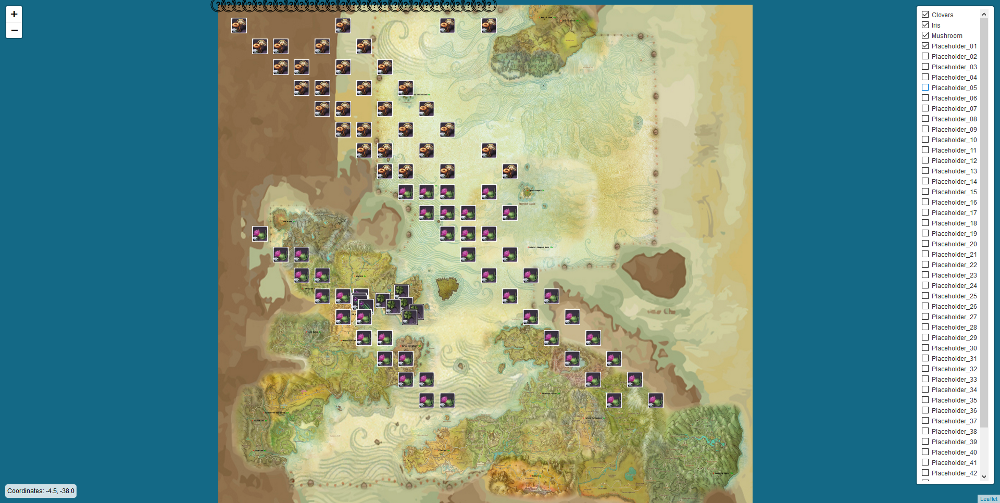
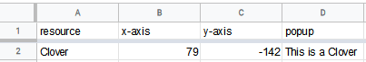
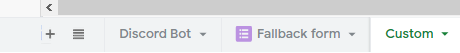

# About Map-Project     
This application can be used to collaboratively fill out the position of resources, mobs, etc on a map. 
https://www.youtube.com/watch?v=HVLnytJOPtY        

# How it works:
You feed the sheet with coordinates and names of the resource you want placed.        
This application stores the google sheet's data.         
Then places markers onto the map using that data.    
Automatically assigns the markers an icon based on the name of the resource (case incensitive).     
Marker popups only appear when there is text in the appropriate cell.                 
Every resource has its own filter.       
You can zoom in and out on the map with scroll wheel or the on screen buttons.    
Coordinate displayed on bottom left.      
On click (LMB) the appropriate command is coppied to the clipboard for ease of input.

# Screenshots:               
The application:            
              

Structure of the google sheet,  
Column setup:     
     
Sheet setup:     

# Based on:    
[Leaflet](https://leafletjs.com/)    
[Atlas-MMO-Resource-Map](https://github.com/ipepe/atlas-mmo-resources-map)     
Optional data feed through:    
[Discord2Sheet-Bot](https://github.com/hugonun/discord2sheet-bot)     
Auth by [Fyren](https://bitbucket.org/FyrenFire/)